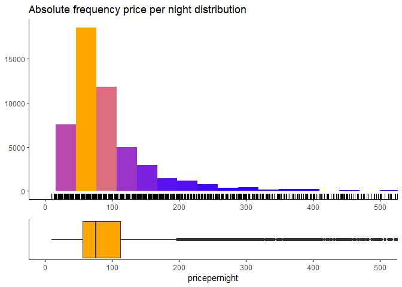
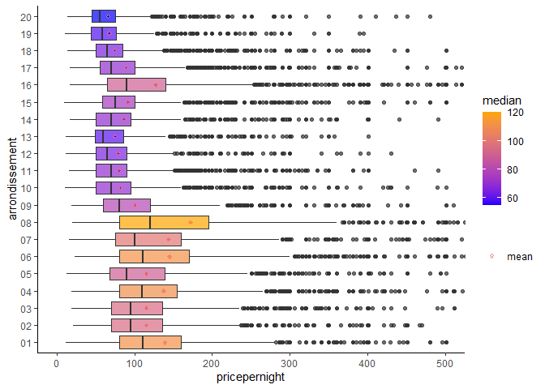
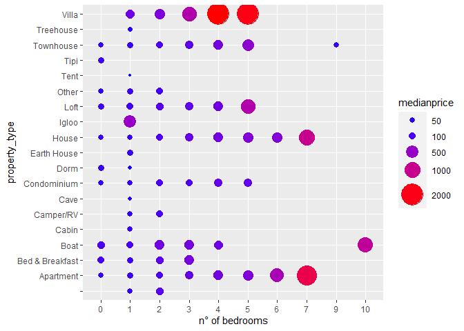

Paris Airbnb dataset EDA
================
Virgile Sarniguet
08/07/2021

## Introduction

Airbnb has become a very controversial topic over the last 10 years,
especially in big urban touristic places like Paris. Indeed the number
of rental per year has been multiplied by 350 between 2011 and 2015 only
in Paris. On the one hand, it allowed a better distribution of tourists
in the city, but on the other hand, more conventional hospitality
companies have been complaining, leading to news legislation. The
expansion of the Airbnb platform has undoubtedly shifted the way
tourists travel, and consider cities has a tourist area. It is thus a
very interesting topic of investigation as it engenders a large amount
of insightful data.

In this project we will explore a dataset of Paris Airbnb data. We will
focus our exploration on “Paris intramuros” (inside the “Boulevard
péripherique”) Airbnb listing, for the years 2010 to 2016. In a first
part, we will discover the dataset and its different variables, select
the most insightful variables and give it a good cleaning. Once our
dataset is nice and tidy, we will explore the different variables
distribution in a second part. In a third part,using the data we got, we
will try to answer some questions as :

-   What parameters can influence the price of rental ?
-   Who are the hosts and what do they do ?
-   How does the number of rental behave over time
    (evolution,seasonality etc.)?

Eventually, we will discuss the different insights we got and their
limitation.

## Part 1 : Dataset discovery and cleaning

In this exploratory data analysis, we will mainly use the `dplyr`
library to tidy and wrangle our data, and `ggplot2` to plot this data.
We thus need to load all the library used in this analysis

``` r
library(dplyr)
library(ggplot2)
library(ggthemes)
library(zoo)
library(lubridate)
library(viridis)
library(plotly)
library(ggmap)
library(ggpubr)
library(cowplot)
library(GGally)
library(ggrastr)
library(DescTools)
library(stringr)
library(ggridges)
```

### General overview and first variable selection

``` r
load("AirBnB.RData")
```

The L dataset has 52725 observations and 95 variables. The function
`View()` is used in the first place to have a general look over the set
and make a first selection of interesting variables, that have less than
5% of NA values. Here, we will just display the whole dataset variables
name.

``` r
colnames(L)
```

    ##  [1] "id"                               "listing_url"                     
    ##  [3] "scrape_id"                        "last_scraped"                    
    ##  [5] "name"                             "summary"                         
    ##  [7] "space"                            "description"                     
    ##  [9] "experiences_offered"              "neighborhood_overview"           
    ## [11] "notes"                            "transit"                         
    ## [13] "access"                           "interaction"                     
    ## [15] "house_rules"                      "thumbnail_url"                   
    ## [17] "medium_url"                       "picture_url"                     
    ## [19] "xl_picture_url"                   "host_id"                         
    ## [21] "host_url"                         "host_name"                       
    ## [23] "host_since"                       "host_location"                   
    ## [25] "host_about"                       "host_response_time"              
    ## [27] "host_response_rate"               "host_acceptance_rate"            
    ## [29] "host_is_superhost"                "host_thumbnail_url"              
    ## [31] "host_picture_url"                 "host_neighbourhood"              
    ## [33] "host_listings_count"              "host_total_listings_count"       
    ## [35] "host_verifications"               "host_has_profile_pic"            
    ## [37] "host_identity_verified"           "street"                          
    ## [39] "neighbourhood"                    "neighbourhood_cleansed"          
    ## [41] "neighbourhood_group_cleansed"     "city"                            
    ## [43] "state"                            "zipcode"                         
    ## [45] "market"                           "smart_location"                  
    ## [47] "country_code"                     "country"                         
    ## [49] "latitude"                         "longitude"                       
    ## [51] "is_location_exact"                "property_type"                   
    ## [53] "room_type"                        "accommodates"                    
    ## [55] "bathrooms"                        "bedrooms"                        
    ## [57] "beds"                             "bed_type"                        
    ## [59] "amenities"                        "square_feet"                     
    ## [61] "price"                            "weekly_price"                    
    ## [63] "monthly_price"                    "security_deposit"                
    ## [65] "cleaning_fee"                     "guests_included"                 
    ## [67] "extra_people"                     "minimum_nights"                  
    ## [69] "maximum_nights"                   "calendar_updated"                
    ## [71] "has_availability"                 "availability_30"                 
    ## [73] "availability_60"                  "availability_90"                 
    ## [75] "availability_365"                 "calendar_last_scraped"           
    ## [77] "number_of_reviews"                "first_review"                    
    ## [79] "last_review"                      "review_scores_rating"            
    ## [81] "review_scores_accuracy"           "review_scores_cleanliness"       
    ## [83] "review_scores_checkin"            "review_scores_communication"     
    ## [85] "review_scores_location"           "review_scores_value"             
    ## [87] "requires_license"                 "license"                         
    ## [89] "jurisdiction_names"               "instant_bookable"                
    ## [91] "cancellation_policy"              "require_guest_profile_picture"   
    ## [93] "require_guest_phone_verification" "calculated_host_listings_count"  
    ## [95] "reviews_per_month"

Here is the list of variable we can keep for further analysis :

``` r
L2<-L%>%
select(c('id','name','description','host_id','host_name','host_is_superhost','host_total_listings_count','neighbourhood_cleansed','zipcode','latitude','longitude','property_type','room_type','accommodates','bathrooms','bedrooms','beds','bed_type','price','number_of_reviews'))
```

Now, we can have a closer look at each selected variable.

``` r
summary(L2)
```

    ##        id                                            name      
    ##  Min.   :    2623   Charming flat in the heart of Paris:   39  
    ##  1st Qu.: 3470301   Appartement au coeur de Paris      :   25  
    ##  Median : 6965852   Cosy flat in the heart of Paris    :   23  
    ##  Mean   : 7069608   Studio                             :   23  
    ##  3rd Qu.:10740059   Cosy studio in the heart of Paris  :   21  
    ##  Max.   :13819560   Charmant studio au coeur de Paris  :   20  
    ##                     (Other)                            :52574  
    ##                                                                                                                                                                                                     description   
    ##  Mon logement est parfait pour les couples, les voyageurs en solo et les voyageurs d'affaires.                                                                                                            :   31  
    ##  Mon logement est parfait pour les couples et les voyageurs en solo.                                                                                                                                      :   15  
    ##  Hello!^^                                                                                                                                                                                                 :   14  
    ##  Mon logement est parfait pour les couples, les voyageurs en solo, les voyageurs d'affaires et les familles (avec enfants).                                                                               :   12  
    ##  Ideally located between Opéra and Saint Lazare , this completely renovated â\200œHausmannianâ\200\235 apartment has been brought to its former glory and enjoys one of the prime locations in the heart of Paris.:    9  
    ##  Mon logement est parfait pour les voyageurs en solo.                                                                                                                                                     :    9  
    ##  (Other)                                                                                                                                                                                                  :52635  
    ##     host_id            host_name     host_is_superhost
    ##  Min.   :    2626   Marie   :  583    :   46          
    ##  1st Qu.: 6158190   Nicolas :  436   f:50513          
    ##  Median :15885410   Pierre  :  418   t: 2166          
    ##  Mean   :22485601   Caroline:  388                    
    ##  3rd Qu.:34348717   Anne    :  387                    
    ##  Max.   :81397049   Sophie  :  372                    
    ##                     (Other) :50141                    
    ##  host_total_listings_count         neighbourhood_cleansed    zipcode     
    ##  Min.   :   0.00           Buttes-Montmartre  : 6025      75018  : 5973  
    ##  1st Qu.:   1.00           Popincourt         : 4883      75011  : 4825  
    ##  Median :   1.00           Vaugirard          : 3878      75015  : 3799  
    ##  Mean   :   5.83           Batignolles-Monceau: 3603      75010  : 3511  
    ##  3rd Qu.:   2.00           Entrepôt          : 3466      75017  : 3465  
    ##  Max.   :1024.00           Passy              : 3074      75020  : 2859  
    ##  NA's   :46                (Other)            :27796      (Other):28293  
    ##     latitude       longitude             property_type  
    ##  Min.   :48.81   Min.   :2.221   Apartment      :50663  
    ##  1st Qu.:48.85   1st Qu.:2.323   Loft           :  567  
    ##  Median :48.86   Median :2.347   House          :  537  
    ##  Mean   :48.86   Mean   :2.344   Bed & Breakfast:  394  
    ##  3rd Qu.:48.88   3rd Qu.:2.369   Condominium    :  266  
    ##  Max.   :48.91   Max.   :2.475   Other          :  122  
    ##                                  (Other)        :  176  
    ##            room_type      accommodates      bathrooms       bedrooms     
    ##  Entire home/apt:45177   Min.   : 1.000   Min.   :0.00   Min.   : 0.000  
    ##  Private room   : 7001   1st Qu.: 2.000   1st Qu.:1.00   1st Qu.: 1.000  
    ##  Shared room    :  547   Median : 2.000   Median :1.00   Median : 1.000  
    ##                          Mean   : 3.051   Mean   :1.09   Mean   : 1.059  
    ##                          3rd Qu.: 4.000   3rd Qu.:1.00   3rd Qu.: 1.000  
    ##                          Max.   :16.000   Max.   :8.00   Max.   :10.000  
    ##                                           NA's   :243    NA's   :193     
    ##       beds                 bed_type         price       number_of_reviews
    ##  Min.   : 0.000   Airbed       :   35   $60.00 : 3055   Min.   :  0.00   
    ##  1st Qu.: 1.000   Couch        : 1182   $50.00 : 3047   1st Qu.:  0.00   
    ##  Median : 1.000   Futon        :  449   $70.00 : 2787   Median :  3.00   
    ##  Mean   : 1.684   Pull-out Sofa: 5066   $80.00 : 2598   Mean   : 12.59   
    ##  3rd Qu.: 2.000   Real Bed     :45993   $100.00: 2073   3rd Qu.: 13.00   
    ##  Max.   :16.000                         $90.00 : 2031   Max.   :392.00   
    ##  NA's   :80                             (Other):37134

Given this summary, we can see that :

-   *name* and *description* can be useful to check the outliers for
    some errors but can be deleted after this step.
-   *host\_total\_listings\_count* seems to have some mistakes. A
    minimum of 0 is not possible and there are a few NA values. I will
    thus create my own variable counting the number of listings per host
    later on.
-   *neighbourhood\_cleansed* is not precise enough to locate the
    different accommodations. Indeed some accommodations located in the
    suburbs are included in Paris neighborhood, and there are too many
    different categories. We will remove this variable.
-   *zipcode* will be used to identify the location area of the
    different observations. We will split Paris intramuros into the 20
    “arrondissements” that compose it. We will also remove all
    observations that are located outside of Paris, meaning all those
    that don’t have a zipcode starting with 75 and all those which have
    a wrong zipcode.
-   Features variables *bathrooms*,*bedrooms* and *beds* have a few NA
    values.The dataset being quite large, we can delete observations
    that have NA values in one of those variables. It will only
    represent a maximum of 516 observations out of 52725, or less than
    1% of the dataset which is fine. As the correlation matrice suggest
    below, *beds* and *accommodates* are highly correlated, which makes
    sens, the number of people accommodated depends on the number of
    beds. We will only keep the *accommodates* variable.

``` r
# check the Spearman's rank correlation coefficient between the continuous variable to spot any relationship between 2 variables.
ggcorr(L2,label=TRUE,hjust = 0.75,method=c("pairwise","spearman"))+
  ggtitle("Continuous variables correlation matrix before cleaning",subtitle = "Shows a high corrolation between the size related variable")
```


### Dataset transformation and cleaning

In this chunk, we will :

-   Select only variables we are interested in.
-   Remove all observations that are outside of Paris (Have a zipcode
    different from 75\#\#\#), and NA value in the variables that
    interest us.
-   Create a new variable with the correct “arrondissement” for each
    observation. By parsing the end of each zipcode (16eme
    “arrondissement” is the only one that have 2 different zipcodes,
    75016 and 75116).
-   Create a new variable *pricepernight* from *price* which is numeric
    and remove the dollar sign. This allows to process calculation and
    use this variable as a continuous one.

``` r
L2<-L2%>%
  select(-c("host_total_listings_count","host_total_listings_count","neighbourhood_cleansed","beds"))%>%
  filter(zipcode %in% c(seq(75001,75020,1),75116),!is.na(bedrooms),!is.na(bathrooms))%>%
  mutate(arrondissement=as.factor(substring(zipcode,5-1,5)),pricepernight=(as.numeric(gsub("[\\$,]","",price))))

#remove the price and zipcode column that have no more utility and create a variable price/accommodates ratio
L2<-L2%>%
  select(-c('price','zipcode'))%>%
  mutate(pricesizeratio=pricepernight/accommodates)
```

We can now have our first view of the price variable distribution

``` r
bp1<-L2%>%
  ggplot(aes(y=pricepernight))+geom_boxplot()+coord_flip()+theme_classic()

bp2<-L2%>%
  ggplot(aes(y=pricepernight))+geom_boxplot_jitter()+coord_flip()+theme_classic()

ggarrange(bp1,bp2,ncol=1)
```


``` r
summary(L2$pricepernight)
```

    ##    Min. 1st Qu.  Median    Mean 3rd Qu.    Max. 
    ##       0      55      75      97     111    6081

Prices are highly concentrated with 75% of observations having a price
per night under 111 dollars. We can also observe on the second plot a
very high number of outliers with sometimes extreme values (6000 dollars
for a night for exemple).

The next step will be to check those outliers and extreme values to make
sure there are not errors. I will use for that the `View()` function to
check observation that have a *pricepernight* under 20 and over 1000
dollars to make sure they are not errors (as a price per month, or other
mistakes).

    View(L2%>%
      filter( pricepernight > 1000))

    View(L2%>%
         filter(pricepernight<20)) 

The following observations were identify as errors. Most of them had a
price per month in the price variable instead of a price per night. Some
of theme had a price of 0 and were identify as mistakes. They will be
removed from the dataset. As we don’t need *name* and *description*
anymore, this variables will also be remove from the dataset.

``` r
L2<-L2%>%
  filter(!(id %in% c(5180527,3493067,12484402,6897854,4984405,8259190,8874063,9269657,11872027,1324779,957071,9173969,2217395,11640000,7474143,7284676,5046286,6755931)))%>%
  select(-c("name","description"))
```

Now that our dataset is clean, we can create our variable that count the
number of accommodations the hosts have in Paris intramuros, and the
average price per night they rent their accommodations.

``` r
# Create a new dataset grouping by host_id, with 2 new variables : number of accommodation that one host possess, average price of accommodations 1 host own.
Lhost<-L2%>%
  group_by(host_id)%>%
  summarise(num_of_accomodation=n(),average_rental_price=mean(pricepernight))

#Join the just created Lhost to our main dataset L2
L2<-inner_join(L2,Lhost,"host_id")
```

From our very clean and beautiful dataset, we will create another
dataset : L4 which will allow us to analyze rental periodicity. For that
we will use `inner_join` to join the database that contains the
different rentals with their date and the listing database. We will also
use the `lubridate` and `zoo` to deal with and transform date type data.

``` r
L4<-
  inner_join(R,L2,by=c('listing_id'='id'))%>%
  mutate(date2=as.Date(date),month=as.factor(months(date2)),year=year(date2),monthyear=as.yearmon(date))
```

From 52725 observations and 95 variables, we have now 51051 observations
and 19 variables, ready for further analysis.

## Part 2 : Variables analysis

In this part, we will mainly use the `ggplot2` library to represent
graphically the selected variables distributions.

### Accomodations related variables distributions

#### **Univariate analysis**

##### 1) Distribution of variables related to type

``` r
# Create a plot for each variable related to type
property_typebp<-L2%>%
  ggplot(aes(x=property_type))+
  geom_bar(aes(fill=..count..),color="black")+
  theme_classic()+
  theme(axis.title.x=element_blank(),
        axis.title.y=element_blank(),
        legend.position = 'none')+
  coord_flip()+
  scale_fill_gradient(low="blue",high="orange")

room_typebp<-L2%>%
  ggplot(aes(x=room_type))+
  geom_bar(aes(fill=..count..),color="black")+
  theme_classic()+
  theme(legend.position = 'none',
        axis.title.x=element_blank(),
        axis.title.y=element_blank())+
  scale_fill_gradient(low="blue",high="orange")

bed_typebp<-L2%>%
  ggplot(aes(x=bed_type))+
  geom_bar(aes(fill=..count..),color="black")+
  theme_classic()+
  theme(legend.position = 'none',
        axis.title.x=element_blank(),
        axis.title.y=element_blank())+
  scale_fill_gradient(low="blue",high="orange")

# arrange 3 plot in 1 figure
ggarrange(property_typebp,
          ggarrange(room_typebp,bed_typebp,nrow=2,labels=c("Room type","Bed Type"),vjust=1.5,hjust = -2.5 ,font.label = list(size = 11)),
          ncol = 2,labels = c("Property type"),vjust=1.5,hjust = -2 ,font.label = list(size = 11))
```


``` r
# Summary of the 3 type related variables
L2%>%
  select(property_type,room_type,bed_type)%>%
  summary()
```

    ##          property_type             room_type              bed_type    
    ##  Apartment      :49097   Entire home/apt:43827   Airbed       :   32  
    ##  Loft           :  547   Private room   : 6719   Couch        : 1151  
    ##  House          :  507   Shared room    :  516   Futon        :  432  
    ##  Bed & Breakfast:  379                           Pull-out Sofa: 4870  
    ##  Condominium    :  255                           Real Bed     :44577  
    ##  Other          :  119                                                
    ##  (Other)        :  158

-   There exists quit a few type of accommodations in Paris, going from
    boats to igloo passing by tipi or treehouse. Nevertheless, 96% of
    listings in Paris are apartment (more than 49000 over 51000). The 4
    other percent are mainly composed by condominium & loft which both
    can be considered as apartment, houses and bed and breakfast.
-   85% of listing are entire home or apartment and the rest are private
    rooms. There are only 516 shared rooms which is less than 1%.
-   87% of listing have a real bed, but surprisingly there are a fare
    amount of pull-out sofa and couch, which might correspond to the
    studios with no bedrooms.

##### 2) Distribution of variable related to the location

It was decided to split Paris borough into “arrondissement”, and not
focus on the different boroughs names (as Pigalle, Menilmontant etc.)
which frontier are not that clear. Here is a map of Paris
“arrondissements”.

<center>

</center>

``` r
#Plot of the number of listing per arrondissement
L2%>%
  ggplot(aes(x=arrondissement))+
  geom_bar(aes(fill=..count..),color="black")+
  theme_classic()+
  theme(legend.position = 'none',
        axis.title.x = element_blank(),
        axis.title.y =element_blank())+
  scale_fill_gradient(low="blue",high="orange")+
  ggtitle("Count of listings per arrondissement")
```


The listings are quit spread across the city, with a high number of
Airbnb listing in every “arrondissement”, but :

-   There are a higher number of listings in the trendy arrondissements
    of 18e which is above the very touristic neighborhood of Montmartre
    and the 11e where is located Bastille, Republique and close to the
    city center.
-   The “arrondissements” that have the lowest number of listings are
    all the ones located in the extra center: 1,2,3,4,5,6,7,8 and the
    13e “arrondissement”.
-   Though, it is important to take in account that some
    “arrondissement” are way bigger than others. Comparing the size of
    the 18e and 1er on Paris map, it appears that the 18e is at least 3
    times bigger than the 1er. Same happens comparing the 11e and the
    3e.

It is easier to visualize on a map the density of airbnb listing in
Paris, using *latitude* and *longitude* variables.

``` r
# Creation of the map base
paris_map5<-get_stamenmap(
  bbox=c(left=2.24,right=2.43,top=48.91,bottom=48.81),
  maptype = "toner-lite",
  zoom=12
  )

#Adding a density plot using the geographical coordinate of each accomodation
ggmap(paris_map5)+
  stat_density2d(
    aes(x = longitude, y = latitude, fill = ..level..,alpha=..level..),
   bins = 15, data = L2,
    geom = "polygon"
    )+scale_fill_viridis(option="magma")+
  ggtitle("Airbnb accomodations density levels in Paris")+
  theme(axis.ticks = element_blank(),
        axis.text = element_blank(),
        axis.title = element_blank())+
  guides(alpha=FALSE)
```


This density map just confirms what seen before, accommodations spread
all across the city with higher density around Montmartre, in north
9e/south 18e and in the city center around Le Marais between 3e/4e where
there is a very high density of listings. 11e and 10 have also a high
density of Airbnb listings.

##### 3) Distribution of variables related to the size of accomodations

``` r
# 1 plot per variable related to size
bedroombp<-L2%>%
  ggplot(aes(x=factor(bedrooms)))+
  geom_bar(aes(fill=..count..),color="black")+
  theme_classic()+
  theme(legend.position = 'none',
        axis.title.x=element_blank(),
        axis.title.y=element_blank())+
  scale_fill_gradient(low="blue",high="orange")

accommodatesbp<-L2%>%
  ggplot(aes(x=factor(accommodates)))+
  geom_bar(aes(fill=..count..),color="black")+
  theme_classic()+
  theme(legend.position = 'none',
        axis.title.x=element_blank(),
        axis.title.y=element_blank())+
  scale_fill_gradient(low="blue",high="orange")

bathroomsbp<-L2%>%
  ggplot(aes(x=factor(bathrooms)))+
  geom_bar(aes(fill=..count..),color="black")+
  theme_classic()+
  theme(legend.position = 'none',
        axis.title.x=element_blank(),
        axis.title.y=element_blank())+
  scale_fill_gradient(low="blue",high="orange")

#arranging 3 plot in 1 figure
ggarrange(accommodatesbp,
          ggarrange(bedroombp,bathroomsbp,ncol=2,
                    labels=c("n° of bedrooms","n° of bathrooms"),
                    vjust=1.5,hjust = -1.5 ,font.label = list(size = 11)),
          nrow = 2,labels = c("n° of accommodated guests"),vjust=1.5,hjust = -1 ,font.label = list(size = 11))
```


``` r
# summary of those 3 variables
L2%>%
  select(c(accommodates,bedrooms,bathrooms))%>%
  summary()
```

    ##   accommodates       bedrooms        bathrooms   
    ##  Min.   : 1.000   Min.   : 0.000   Min.   :0.00  
    ##  1st Qu.: 2.000   1st Qu.: 1.000   1st Qu.:1.00  
    ##  Median : 2.000   Median : 1.000   Median :1.00  
    ##  Mean   : 3.055   Mean   : 1.058   Mean   :1.09  
    ##  3rd Qu.: 4.000   3rd Qu.: 1.000   3rd Qu.:1.00  
    ##  Max.   :16.000   Max.   :10.000   Max.   :8.00

The absolute frequencies of this 3 variables related to the size of
accommodations suggest that :

-   There is a high accommodations size range, going from 0 to 10
    bedrooms, accommodating from 1 to 16 people and having from 1 to 8
    bathrooms
-   Most of the accommodations are relatively small. Indeed 95% of
    observations have only 0 to 2 bedrooms, 1 bathroom and can
    accommodates from 1 to 5 guests.

#### **Bivariate analysis of categorical variables**

After this first look over the categorical accommodations related
variables distribution, we can try to cross those variables to answer to
some questions that already makes us scratch our head:

-   Are the accommodations bigger in some “arrondissement” ?
-   Do the sofa-beds correspond to very small flat ? etc.

##### 1) Crossing location and size

``` r
L2%>%
  ggplot(aes(x=arrondissement,fill=factor(bedrooms)))+
  geom_bar(position = "fill")+
  theme_classic()+
  coord_flip()+
  scale_fill_discrete(name = "n° of bedrooms")+
  labs(y="relative frequency")
```


18e and 16e “arrondissements” seem to have a slightly higher proportion
of listing with more than 1 bedroom.

##### 2) Crossing location and type

``` r
L2%>%
  ggplot(aes(x=arrondissement,fill=factor(room_type)))+
  geom_bar(position = "fill")+
  theme_classic()+coord_flip()+
  scale_fill_discrete(name = "Room type")+
  labs(y="relative frequency")
```


There is a slightly higher proportion of private rooms in 13e, 19e and
20e. This proportion is generally lesser in the very central
“arrondissement” (1,2,3,4,5,) and 16e

##### 3) Crossing type and size

``` r
p1<-L2%>%
  filter(property_type != "")%>%
  ggplot(aes(x=property_type,fill=factor(bedrooms)))+
  geom_bar(position = "fill")+
  theme_classic()+
  theme(legend.background = element_rect(fill = "white", color = "black"))+
  coord_flip()+
  labs(y="relative frequency")+
  scale_fill_discrete(name = "n° of bedrooms")


p2<-L2%>%
  ggplot(aes(x=bed_type,fill=factor(bedrooms)))+
  geom_bar(position = "fill")+
  theme_classic()+
  coord_flip()+
  labs(y="relative frequency")

ggarrange(p1,p2,common.legend = TRUE)
```


-   Some property types tend to be bigger than other : Villas, Townhouse
    ,Loft , House and boat
-   We can find couch and pull out sofas mainly in studios with no
    bedrooms or flat with only 1 bedroom as we would expect. The other
    “weird” type of beds like Futon, Airbed are encounter in 0 or 1
    bedroom apartment too.

### Other numerical variables

##### 1) Number of reviews

``` r
hisplot<-L2%>%
  ggplot(aes(x=number_of_reviews))+
  geom_histogram(aes(fill=..count..),bins=120)+
  theme_classic()+
  theme(axis.title.y = element_blank(),
        axis.title.x = element_blank(),
        legend.position = 'none',)+
  scale_fill_gradient(low="blue",high="orange")+
  geom_rug(aes(x=number_of_reviews))+ggtitle("Absolute frequency number of reviews distribution")

boxp<-L2%>%
  ggplot(aes(x=number_of_reviews))+geom_boxplot(fill="orange")+theme_classic()+theme(legend.position = 'none',axis.text.y=element_blank(),axis.ticks.y = element_blank())
      

cowplot::plot_grid(hisplot, boxp, 
                   ncol = 1, rel_heights = c(3, 1),
                   align = 'v', axis = 'lr')
```


``` r
summary(L2$number_of_reviews)
```

    ##    Min. 1st Qu.  Median    Mean 3rd Qu.    Max. 
    ##    0.00    0.00    3.00   12.65   13.00  392.00

The *number of review variable* has a big range in comparison to its
concentration. Indeed, it goes from 0 to 392 reviews, but 75% of
listings have less than 13 reviews. Also, 13775 listings have no
comments at all.

##### 2) Focus on Price per night distribution

``` r
hisplot<-L2%>%
  ggplot(aes(x=pricepernight))+
  geom_histogram(aes(fill=..count..),bins=120)+
  theme_classic()+
  theme(axis.title.y = element_blank(),
        axis.title.x = element_blank(),
        legend.position = 'none',)+
  scale_fill_gradient(low="blue",high="orange")+
  geom_rug(aes(x=pricepernight))+ggtitle("Absolute frequency price per night distribution")
boxp<-L2%>%
  ggplot(aes(x=pricepernight))+geom_boxplot(fill="orange")+theme_classic()+theme(legend.position = 'none',axis.text.y=element_blank(),axis.ticks.y = element_blank())
      

cowplot::plot_grid(hisplot, boxp, 
                   ncol = 1, rel_heights = c(3, 1),
                   align = 'v', axis = 'lr')
```


We notice straight away that the range is very large, going from 9 to
3608 dollars per night. On the other hand, prices are highly
concentrated around the small values, and there is a large amount of
outliers and extreme values.

Let´s zoom-in.

``` r
hisplot2<-L2%>%
  ggplot(aes(x=pricepernight))+
  geom_histogram(aes(fill=..count..),bins=120)+
  theme_classic()+
  theme(axis.title.y = element_blank(),
        axis.title.x = element_blank(),
        legend.position = 'none',)+
  scale_fill_gradient(low="blue",high="orange")+
  geom_rug(aes(x=pricepernight))+ggtitle("Absolute frequency price per night distribution")+
  coord_cartesian(xlim = c(0,500))

boxp2<-L2%>%
  ggplot(aes(x=pricepernight))+
  geom_boxplot(fill="orange")+
  theme_classic()+
  theme(legend.position = 'none',
        axis.text.y=element_blank(),
        axis.ticks.y = element_blank())+
  coord_cartesian(xlim = c(0,500))
      

cowplot::plot_grid(hisplot2, boxp2, 
                   ncol = 1, rel_heights = c(3, 1),
                   align = 'v', axis = 'lr')
```



``` r
summary(L2$pricepernight)
```

    ##    Min. 1st Qu.  Median    Mean 3rd Qu.    Max. 
    ##     9.0    55.0    75.0    96.6   111.0  3608.0

Indeed, 50% of observations have a price per night between 55 and 111
dollars, and 95% of observations have a price per night between 9 and
226 dollars per night, 99% under 401 dollars. There is a very high
number of outliers and extreme outliers, which correspond to very
luxurious accommodations.

##### Probability density function

``` r
L2%>%
  ggplot(aes(x=pricepernight,y=..density..))+geom_histogram(aes(fill=..count..),bins=120,show.legend = FALSE)+geom_density()+theme_classic()+
  theme(legend.justification = c(1, 1), 
        legend.position = c(1,1),
        legend.background = element_rect(fill = "white", color = "black"))+
scale_fill_gradient(low="blue",high="orange")+coord_cartesian(xlim=c(0,500))+
  geom_vline(aes(xintercept = mean(pricepernight),color="mean"),linetype = "dashed", size = 0.6)+
  geom_vline(aes(xintercept = median(pricepernight),color="median"),linetype = "dashed", size = 0.6,show.legend = TRUE)+
  geom_vline(aes(xintercept = Mode(pricepernight),color="mode"),linetype = "dashed", size = 0.6,show.legend = TRUE)+
  guides(fill=FALSE)+
  scale_color_manual(name = "averages", values = c(median = "blue", mean = "red",mode="green"))+
  ggtitle("probability density function")
```


``` r
# Quantile and skewness measure
quantile(L2$pricepernight,probs=c(0.25,0.75,0.90,0.95,0.99))
```

    ## 25% 75% 90% 95% 99% 
    ##  55 111 169 226 401

``` r
Kurt(L2$pricepernight)
```

    ## [1] 198.0597

``` r
Skew(L2$pricepernight)
```

    ## [1] 8.870281

-   We have a higher mean (96.6) than the median (75) higher than the
    mode (60). Data is highly concentrated around those moments.The
    probability density function of *pricepernight* is highly positively
    skewed. High number of outliers tends to distort the mean. We then
    must be careful with the mean and standard deviation signification
    for this variable. We will thus better use median and mode as
    averages and interquantile ranges to describe variability in this
    analysis.

-   We also notice some little bumps in the density which corresponds to
    rounded values as 120, 150, 200, 250, 300, 350 etc. The hosts tend
    to set a rounded number as a price per night for their
    accommodations.

In this part, by exploring the different variables related to
accommodations, we got a better idea of what compose the Airbnb offer in
Paris. This will help us for this 3rd part in which we will go further
into this dataset analysis.

## Part 3 : Further exploration of the dataset

### What parameters can influence rental prices ?

#### **Univariate analysis**

##### 1) Location

###### Price per night distribution per “arrondissement”

``` r
L2%>%
  group_by(arrondissement)%>%
  mutate(median=median(pricepernight))%>%
  ggplot(aes(x=arrondissement,fill=median))+
  geom_boxplot(aes(y=pricepernight),alpha=0.7)+
  stat_summary(aes(y=pricepernight,color="mean"),fun = "mean", size = 1, geom = "point",shape=23)+
  theme_classic()+
  theme()+
  coord_flip()+
  scale_fill_gradient(low="blue", high="orange")+
  labs(colour="")
```


``` r
# Zooming in
L2%>%
  group_by(arrondissement)%>%
  mutate(median=median(pricepernight))%>%
  ggplot(aes(x=arrondissement,fill=median))+
  geom_boxplot(aes(y=pricepernight),alpha=0.7)+
  stat_summary(aes(y=pricepernight,color="mean"),fun = "mean", size = 1, geom = "point",shape=23)+
  theme_classic()+
  theme()+
  coord_flip(ylim=c(0,500))+
  scale_fill_gradient(low="blue", high="orange")+
  labs(colour="")
```



``` r
# plot of price/night PDF per arrondissement
L2%>%
ggplot(aes(x = pricepernight, y = arrondissement, fill = 0.5 - abs(0.5 - stat(ecdf)))) +
  stat_density_ridges(geom = "density_ridges_gradient", calc_ecdf = TRUE) +
  scale_fill_viridis_c(option="turbo",name = "Tail probability", direction = -1)+
  coord_cartesian(xlim=c(0,400))+
  ggtitle("price/night PDF per arrondissement")
```


We can fully understand from those plots that there exists some
differences in price per night distributions from one “arrondissement”
to another :

-   Except for the 16e, “arrondissements” located on the edges of paris
    (12, 13, 14, 15, 17, 18, 19, 20) along the “peripherique” have lower
    median price per night and a lower variability in prices (smaller
    range, interquartile range and sharper PDF). The 19 and 20
    “arrondissements”, located on the est side are the cheapest
    “arrondissement” regarding their median price and have the lowest
    price variability (smaller interquartile range and sharper PDF).
    Historically in Paris, the poorest neighborhood are located on the
    east side (19,18,20,13,12) and the richest on the west side
    (14,15,16,17), and it is still true now a days. Also, most of the
    more modest neighborhood don’t have much tourist attraction, except
    Montmarte in the south of 18eme.

-   In the middle we have the 10 11 and 9 “arrondissement” which are
    more central but not fully in Paris center and have intermediate
    median price and price variability.

-   On the other hand, very central “arrondissements” (1, 2, 3, 4, 5, 6,
    7, 8) and the 16e which is the fanciest neighborhood of Paris and
    close to the Champs-Élysées and Eiffel Tower, have the highest
    median price per night and higher price variability (flatter PDF and
    bigger interquartile range). They also have more outliers and
    extreme values which tends to separate the mean from the median. We
    can easily understand why the most expensive “arrondissement” is the
    8th, as it is the most beautiful neighborhood, ideally located in
    the center, between the Champs-Élysées, the Eiffel Tower and the
    city center.

``` r
# Create a new set dividing the observations in groups depending on the price range they belong to
Linter2<-L2%>%
  mutate(group=cut(pricepernight,breaks=c(0,50,150,300,700,1500,3700),labels=c("<=50","51-150","151-300","300-700","700-1500",">1500")))
 
#Density maps of listing according to their price range group 
  ggmap(paris_map5)+
  stat_density2d(
    aes(x = longitude, y = latitude, fill = ..level..,alpha=..level..),
   bins = 15, data = Linter2,
    geom = "polygon"
    )+scale_fill_viridis(option="magma")+
    ggtitle("Density levels of airbnb accomodations per price per night range")+
    theme_classic()+
    theme(axis.text = element_blank(),
         axis.title = element_blank(),
         axis.ticks = element_blank(),
         legend.position = "none",
         plot.title = element_text(size = 11)
         )+
    facet_wrap(~ group)
```


``` r
  # barplot of number of listings per arrondissements faceted by price range.  
  Linter2%>%
  ggplot(aes(x=arrondissement))+
    geom_bar(aes(fill=..count..))+
    theme_classic()+
    theme(legend.position = "bottom",
          axis.text.x = element_text(angle= 90,vjust = 0.5,size = 8 ))+
  scale_fill_gradient(low = "blue", high = "orange")+
    facet_wrap(~group,scales = "free_y") 
```


The density levels of Airbnb listing and the barplots give us a few
insight :

-   The cheapest accommodations &lt;= 50 are mainly located on the edge
    of Paris with higher density levels in 18e, 19e and 20eme
    arrondissements. There are almost none in the central
    “arrondissements” (1, 2, 3, 4, 5, 6, 7, 8).
-   The intermediate price range 50 to 150 correspond to the global
    dataset distribution with listings everywhere across the city, with
    higher density around Montmartre (9e and 18e arrondissements) and
    around “Le Marais”(3,4) and “Bastille/République” (10 and 11)
-   The higher intermediate prices concentration is shifting to the very
    center : Le Marais, île saint-louis in 5th arrondissement, 9th
    arrondissement concentrate the most accommodations. 16 and 8th
    “arrondissement” also have a few of them.
-   As the price range goes up, the highest density levels shift towards
    the extra center 1,2,3,4,5 and the neighborhood next to the
    Champs-Élysées, located in 16th and 8th “arrondissements”.
-   Eventually, the most expensive accommodations are highly
    concentrated around the Champs-Élysées and Eiffel-tower in the 8e
    and 16e “arrondissements”.

Regarding the location, price per night seems to be correlated to
several geographical factor :

-   Quality of the neighborhood. If it is a rich or more modest
    neighborhood.
-   Proximity to the city center
-   Proximity to the “Champs-Élysées and Eiffel-tower”.

##### 2) Size of the accommodation

``` r
bedo<-L2%>%
  group_by(factor(bedrooms))%>%
  mutate(median=median(pricepernight))%>%
  ggplot(aes(x=factor(bedrooms),fill=median))+
  geom_boxplot(aes(y=pricepernight),alpha=0.7)+
  stat_summary(aes(y=pricepernight,color="mean"),fun = "mean", size = 1, geom = "point",shape=23)+
  theme_classic()+theme()+coord_flip(ylim=c(0,2000))+
  scale_fill_gradient(low="blue", high="orange")+
  labs(x="bedrooms",colour="")

aco<-L2%>%
  group_by(factor(accommodates))%>%
  mutate(median=median(pricepernight))%>%
  ggplot(aes(x=factor(accommodates),fill=median))+
  geom_boxplot(aes(y=pricepernight),alpha=0.7)+
  stat_summary(aes(y=pricepernight,color="mean"),fun = "mean", size = 1, geom = "point",shape=23)+
  theme_classic()+
  theme(axis.title.x = element_blank())+
  coord_flip(ylim=c(0,2000))+
  scale_fill_gradient(low="blue", high="orange")+
  labs(x = "Accomodates", colour="")

ggarrange(aco,bedo,nrow = 2,common.legend = TRUE,legend = "right")
```


The distribution of *pricepernight* according to the size of the
accommodation clearly shows that the bigger, the more expensive. Indeed
whether it is the number of people accommodated or the number of rooms,
the bigger it gets, the higher is the median price. We also notice that
bigger accommodations tend to have higher variability in prices.

##### 3) Type of accommodation

``` r
L2%>%
  group_by(property_type)%>%
  mutate(median=median(pricepernight))%>%
  ggplot(aes(x=property_type,fill=median))+
  geom_boxplot(aes(y=pricepernight),alpha=0.7)+
  stat_summary(aes(y=pricepernight,color="mean"),fun = "mean", size = 1, geom = "point",shape=23)+
  theme_classic()+
  theme()+
  coord_flip(ylim=c(0,2000))+
  scale_fill_gradient(low="blue", high="orange")+
  labs(colour="")
```


-   Certain types of accommodations tend to be more expensive as villas,
    boats, house. Nevertheless it might be because those kind of types
    can accommodates more guests. We can check the price/size ratio
    distribution per property\_type to be sure of that.

``` r
L2%>%
  group_by(property_type)%>%
  mutate(median=median(pricesizeratio))%>%
  ggplot(aes(x=property_type,fill=median))+
  geom_boxplot(aes(y=pricesizeratio),alpha=0.7)+
  stat_summary(aes(y=pricesizeratio,color="mean"),fun = "mean", size = 1, geom = "point",shape=23)+
  theme_classic()+
  theme()+
  coord_flip(ylim=c(0,300))+
  scale_fill_gradient(low="blue", high="orange")+
  labs(colour="")
```


-   No matter the size, dorm are the cheapest type of accommodation.
-   Apartment is the most encountered type and prices are quite
    concentrated around its median but have quit a lot of outliers with
    extreme values.
-   Villas a significantly more expensive than the other accommodation
    types.

``` r
roomo<-L2%>%
  group_by(room_type)%>%
  mutate(median=median(pricepernight))%>%
  ggplot(aes(x=room_type,fill=median))+
  geom_boxplot(aes(y=pricepernight),alpha=0.7)+
  stat_summary(aes(y=pricepernight,color="mean"),fun = "mean", size = 1, geom = "point",shape=23)+
  theme_classic()+
  theme()+
  coord_flip(ylim=c(0,2000))+
  scale_fill_gradient(low="blue", high="orange")+
  labs(colour="")

tbed<-L2%>%
  group_by(bed_type)%>%
  mutate(median=median(pricepernight))%>%
  ggplot(aes(x=bed_type,fill=median))+
  geom_boxplot(aes(y=pricepernight),alpha=0.7)+
  stat_summary(aes(y=pricepernight,color="mean"),fun = "mean", size = 1, geom = "point",shape=23)+
  theme_classic()+
  theme(axis.title.x = element_blank())+
  coord_flip(ylim=c(0,2000))+
  scale_fill_gradient(low="blue", high="orange")+
  labs(colour="")

ggarrange(tbed,roomo,nrow=2,common.legend = TRUE, legend = "right",align = "v")
```


-   Type of room also influence the price, indeed an entire apartment
    will be more expensive than a private room, and the private room
    more expensive than a shared-room.
-   Different types of bed also have a different distribution in prices,
    surely because the airbed, futon and sofa correspond to smaller
    accommodations.

##### 4) Number of reviews

``` r
L2%>%
  ggplot(aes(y=pricepernight,x=number_of_reviews))+
  geom_point()+
  geom_smooth(formula= y ~ x,se=FALSE)+
  theme_classic()
```


``` r
cor(L2$number_of_reviews,L2$pricepernight, method="spearman")
```

    ## [1] 0.001932152

The adjusted mean curve suggests that the number of reviews doesn’t have
any influence on the price per night. However, the scatter point
suggests a higher variability in prices as the number of reviews get
smaller.

#### **Bivariate analysis of the price**

In this section, we will cross some categorical variables to observe how
combined, they can influence the price per night. We will use the median
price to compare them, as the high number of outliers and extreme values
in some categories tend to distort the mean. We will also use the number
of bedrooms to evaluate the size of listings for comparison.

##### 1) Location and size

``` r
L2%>%
  group_by(bedrooms,arrondissement)%>%
  summarise(medianprice=median(pricepernight))%>%
  ggplot(aes(x=arrondissement,factor(bedrooms)))+
  geom_point(aes(size=medianprice,color=medianprice))+
  scale_color_continuous(low = "blue", high = "red", breaks = c(50,100,500,1000,2000,5000) )+
  scale_size(breaks=c(50,100,500,1000,2000,5000),range = c(1, 11))+
  guides(color= guide_legend(), size=guide_legend())+
  labs(y="n° of bedrooms")
```


This plot allows us to confirm that the size indeed influence the price
but, also allows us to compare the prices per “arrondissements” for
accommodations of the same size. We verify that for the same sizes,
listings have a higher median price in some arrondissements than others.
Indeed, in the most common size from 0 to 4 bedrooms, prices are always
higher in the central “arrondissements” (1,2,3,4,5,6,7,8) and the 16e.
On the other hand, 19e 20e 13e and 12e are always the cheapest.

##### 2) Location and type

``` r
L2%>%
  group_by(property_type,arrondissement)%>%
  summarise(medianprice=median(pricepernight))%>%
  ggplot(aes(x=arrondissement,property_type))+
  geom_point(aes(size=medianprice,color=medianprice))+
  scale_color_continuous(low = "blue", high = "red", breaks = c(50,100,500,1000,2000,5000) )+
  scale_size(breaks=c(50,100,500,1000,2000,5000),range = c(1, 11))+
  guides(color= guide_legend(), size=guide_legend())
```


We can observe the same phenomenon here, whatever the “arrondissement”,
some property types are more expensive as Villas. Also, we observe that
whatever the type of property, some arrondissements are more expensive,
as 8e or 16e.

##### 3) Type and size

``` r
L2%>%
  group_by(property_type,bedrooms)%>%
  summarise(medianprice=median(pricepernight))%>%
  ggplot(aes(x=factor(bedrooms),property_type))+
  geom_point(aes(size=medianprice,color=medianprice))+
  scale_color_continuous(low = "blue", high = "red", breaks = c(50,100,500,1000,2000,5000) )+
  scale_size(breaks=c(50,100,500,1000,2000,5000),range = c(1, 11))+
  guides(color= guide_legend(), size=guide_legend())+
  labs(x="n° of bedrooms")
```



Having the same size, Villas are always more expensive in high
proportion. On the other hand, it is quite surprising to see that having
the same amount of bedrooms, Apartment, House and town house have quite
the same prices and apartment even tend to be more expensive than
Houses. Loft and bed&breakfast are more expensive than apartment with
comparable size.

This bivariate analysis shows us that the size seems to be the major
factor of influence on the price per night, followed by the location and
then certain property type.

#### **Correlation matrix**

The correlation matrix can give a idea of the degree of relationship
between 2 numerical variables.

``` r
# We use the spearman method as the distribution of price per night is not normal, has a lot of outliers and the factors variables are numeric discrete and ranked (as number of bedrooms) 
ggcorr(L2,label=TRUE,hjust = 0.75,method = c("pairwise", "spearman"))+
  ggtitle("Continuous variables correlation matrix")
```


The correlation matrix displaying the spearman correlation coefficient
suggest that there exists a moderate relationship (0.5 and 0.6 spearman
coefficient) between the size related variables
*accommodates*-*bedrooms* and *pricepernight*.

To sum up this part regarding the variables that can influence the price
per night of a Airbnb listing in Paris, we have observed that the size,
location and types are factors that have an influence on the price per
night. On the other hand the number of reviews doesn’t seem to have any
influence on the price per night. After having explored the variables
related to the accommodations and price, We will now focus our attention
on the hosts.

### Who are the hosts ?

#### 1) Superhosts

``` r
chipoli<-L2%>%
  filter(host_is_superhost %in% c("f","t"))%>%
  dplyr::group_by(host_id)%>%
  summarise(superhost=str_count(host_is_superhost,"f"))

chipoli<-chipoli%>%
  dplyr::group_by(host_id)%>%
  summarise(superhost=mean(superhost))
  
chipoli%>%
   ggplot(aes(x=factor(superhost)))+
  geom_bar(aes(fill=..count..),color="black")+
  theme_classic()+
  theme(legend.position = 'none',
        axis.title.x=element_blank(),
        axis.title.y=element_blank())+
  scale_fill_gradient(low="blue",high="orange")+
  ggtitle("Host is a superhost")+
  scale_x_discrete(labels=c("True","False"))
```


Among the 43472 different hosts that own at least 1 Airbnb listing in
Paris intramuros, only 1812 are superhosts (4%).

#### 2) Number of accomodation per host

``` r
 plot1<-L2%>%
  dplyr::group_by(host_id)%>%
  summarise(num_of_listing=mean(num_of_accomodation))%>%
  ggplot()+
  geom_histogram(aes(x=num_of_listing,fill=..count..),bins=153)+
  geom_rug(aes(x=num_of_listing))+
  theme_classic()+
  theme(legend.position = "none")+
  scale_fill_gradient(low="blue",high = "orange")+
  labs(x="number of listings")

 plot2<-L2%>%
  dplyr::group_by(host_id)%>%
  summarise(num_of_listing=mean(num_of_accomodation))%>%
  ggplot()+
   geom_bar(aes(x=factor(num_of_listing),fill=..count..))+
   theme_classic()+theme(legend.position = "none")+
   scale_fill_gradient(low="blue",high = "orange")+
   coord_cartesian(xlim=c(0,10))+labs(x="number of listings")

ggarrange(plot1,plot2,nrow=2)
```


The range of *number of listing* goes from 1 to 153 but the strict
majority of hosts only own 1 listing in Paris intramuros. Indeed, 40350
out of the 43472 different host have only 1 listing (93%). 2450 hosts
(5.6%) have 2 listings. The 2% remaining are multilisting owners.

Who are this owner that have several accommodations ?

``` r
head(L2%>%
  group_by(host_id,host_name)%>%
  summarise(numacommodation=n())%>%
  dplyr::arrange(desc(numacommodation)),50)
```

    ## # A tibble: 50 x 3
    ## # Groups:   host_id [50]
    ##     host_id host_name         numacommodation
    ##       <int> <fct>                       <int>
    ##  1  2288803 Fabien                        153
    ##  2  2667370 Parisian Home                 137
    ##  3 12984381 Olivier                        89
    ##  4  3972699 Hanane                         78
    ##  5 21630783 Pierre                         64
    ##  6 39922748 Clara                          64
    ##  7  3943828 Caroline                       62
    ##  8   789620 Charlotte                      56
    ##  9 11593703 Rudy And Benjamin              56
    ## 10   152242 Delphine                       53
    ## # ... with 40 more rows

Having a look at the 50 owners that own the highest number of
accommodations listed on Airbnb, we notice that most of them are private
owners but there are also some companies as “Parisian home” or “My
Apartment in Paris” that seems to manage some listings.

#### 3) Prices

Does the fact that owners are superhost or own several listings have an
influence on the price per night ?

``` r
L2%>%
  filter(host_is_superhost %in% c("t","f"))%>%
  group_by(factor(host_is_superhost))%>%
  mutate(median=median(pricesizeratio))%>%
  ggplot(aes(x=factor(host_is_superhost),fill=median))+
  geom_boxplot(aes(y=pricesizeratio),alpha=0.7)+
  stat_summary(aes(y=pricesizeratio,color="mean"),fun = "mean", size = 1, geom = "point",shape=23)+
  theme_classic()+
  coord_flip()+
  scale_fill_gradient(low="blue", high="orange")+
  labs(x = "Host is super host",y="price size ratio", colour="")
```


``` r
L2%>%
  dplyr::group_by(host_id)%>%
  summarise(num_of_listing=n(),average_price=mean(pricepernight))%>%
  ggplot()+
  geom_point(aes(x=num_of_listing,y=average_price))+
  theme_classic()+
  theme(legend.position = "none")+
  scale_fill_gradient(low="blue",high = "orange")+
  geom_smooth(aes(x=num_of_listing,y=average_price))
```


``` r
# Create a set grouping observations by the number of listings their hosts has
Linter3<-L2%>%
  mutate(group=cut(num_of_accomodation,breaks=c(0,1,2,5,15,50,154),labels=c("1","2","3-5","6-15","16-50",">50")))

Linter3%>%
  group_by(group)%>%
  mutate(median=median(pricepernight))%>%
  ggplot(aes(x=group,fill=median))+
  geom_boxplot(aes(y=pricepernight),alpha=0.7)+
  stat_summary(aes(y=pricepernight,color="mean"),fun = "mean", size = 1, geom = "point",shape=23)+
  theme_classic()+
  theme()+
  coord_flip(ylim = c(0,500))+
  scale_fill_gradient(low="blue", high="orange")+
  labs(x="n° of listings own by the host", colour="")
```


``` r
# plot of price/night PDF per number of listing owned
Linter3%>%
ggplot(aes(x = pricepernight, y = group, fill = 0.5 - abs(0.5 - stat(ecdf)))) +
  stat_density_ridges(geom = "density_ridges_gradient", calc_ecdf = TRUE) +
  scale_fill_gradient(low = "blue",high="orange",name="Tail probability")+
  coord_cartesian(xlim=c(0,400))+
  ggtitle("price/night PDF per number of listing owned")+
  labs(y="n° of listings own by the host", colour="")
```


-   We can not affirm that being or not a superhost induce higher price
    as their price/size ratio distribution overlap. Furthermore, the
    number of observation is too different between both group to draw
    any conclusion.
-   Regarding the number of listing, it seems that graphically hosts
    owning more than 1 apartment have a higher average and median price
    of rental. Indeed the price per night distribution of the owner
    having 1 listing and those having over 50 listing seems graphically
    quit different.
    -   The range for host having 1 listing is the largest, going from 9
        to 3506. we observe a lot of outliers with very high price for
        this group. Nevertheless the distribution is quit concentrated
        around the median (70 dollars), and it is also the group that
        have the smallest interquartile range (47 dollars) and the
        sharpest PDF.
    -   Regarding the groups of hosts having between more than 16
        listings, the median/mean and interquartile ranges are around 2
        times higher than the host have 1 listing : 16-50
        median;mean;interquartile = 142;188;122 &gt;50
        median;mean;interquartile = 165;188;100. The PDF is way flatter
        meaning a higher variability in prices

We could then assume that those hosts who own multiple listings are
investors who would invest in the most profitable areas. We can have a
look at the location of their listings.

#### 4) Location

``` r
  ggmap(paris_map5)+
  stat_density2d(
    aes(x = longitude, y = latitude, fill = ..level..,alpha=..level..),
   bins = 15, data = Linter3,
    geom = "polygon"
    )+scale_fill_viridis(option="magma")+
    ggtitle("Density levels of airbnb accomodations per number of accomodations owned by the hosts")+
    theme(axis.text = element_blank(),
         axis.title = element_blank(),
         axis.ticks = element_blank(),
         legend.position = "none",
         plot.title = element_text(size = 11)
         )+
    facet_wrap(~ group)
```


We can indeed observe that there exists some difference of location
according to the number of accommodations own by a host :

-   Accommodations of hosts that possess 1 or 2 listings are spread all
    across the city with higher density around 18eme and 11eme just as
    the global density distribution of the whole dataset.

-   Accommodations of host that possess more than 5 listings are more
    concentrated, especially in the extra center(1e and 2e) around le
    Marais (3e and 4e) and south of the “seine” in the latin
    neighborhood (5e and 6e “arrondissements”), a bit less around the
    Champs-Elysees/Tour Eiffel (8e ,16e, 17e “arrondissements”) and a
    bit of 18e. The density in north east, east, south east outer areas
    along the “peripherique” (19e, 20e, 12e, 13e, 14e, 15e) are very
    low.

To sum up, we have learned that the vast majority of host only have one
listing and are not superhost. We can assume that this kind of host rent
the place where they live. Few of the hosts have several and even a
large number of listings for some of them. Some of those multilistings
owner are private companies. The fact of being a super host does not
have any influence on the price per night. On the other hand, host that
have more than 5 listings tends to have them located in the most
touristic and profitable neighborhood, and rent them at higher prices.

### Time serie analysis

In this section, the L4 dataset created earlier will be used. This set
is joining the list of Airbnb rentals with dates from 2009 to 2006 and
the set of listing with information we have dealt with so far.

#### 1) Global evolution

``` r
L4%>%
  filter(monthyear!="juil. 2016")%>%
  group_by(monthyear)%>%
  summarise(numofrental=n())%>%
  ggplot(aes(x=monthyear,y=numofrental))+
  geom_point(aes(y=numofrental))+
  geom_line()+
  geom_smooth(se = FALSE)+
  theme_classic()+
  ggtitle("Evolution of the number of airbnb rental per month",subtitle = "in Paris intramuros from January 2010 to June 2016")
```


Here, we have removed the month of July 2016 as we do not have the whole
month data. What can we learn from this plot ?

-   There was a tremendous evolution of the number of Airbnb rental in
    Paris intramuros over those 6 years, passing from 9 rental in
    January 2010 to 23862 in January 2016.
-   It seems that there exists some kind of periodicity in the number of
    rental. Indeed, the number of rental in going down in February and
    high up in October.

Let´s have a closer look at the periodicity

#### 2) Periodicity

``` r
L4%>%
  group_by(year,month)%>%
  summarize(nummonth=n())%>%
  ggplot(aes(x=factor(month,levels=c('janvier','février','mars','avril','mai','juin','juillet','août','septembre','octobre','novembre','décembre')),
             y=nummonth))+
  geom_line(aes(group=(year),linetype=factor(year),color=factor(year)))+
  geom_point(aes(color=factor(year)))+
  facet_wrap(~year,scale="free_y")+    
  theme_classic()+
  xlab('Month of the year')+
  ylab('n° of rental')+
  theme(legend.position = "none",
          axis.text.x = element_text(angle = 90,vjust=0.5,hjust=1))
```


There exists a clear periodicity pattern that can be verified every year
:

-   Number of rental are at the lowest in February.

-   Then it rises gradually until June-July and either stabilize or go
    down in August. One could think that there is a mistake in the data
    as August is the summer holiday month in France an Europe so it
    should be one of the busiest in terms of rentals. The answer is that
    foreigner tourists continue to travel to Paris in August at a same
    level as July and other months, but french tourists visitation of
    Paris is dropping by a lot in August every year. They must be more
    interested in other holidays destinations for summertime.

-   The number of rental then rises again in September to reach its top
    level every year in October.

-   It then drops gradually until February an the cycle repeats itself
    every year.

#### 3) By arrondissement

Is the periodicity the same for all “arrondissements” ?

Let’s take 2014 for instance.

``` r
L4%>%
  filter(year %in% c("2014"))%>%
  group_by(year,month,arrondissement)%>%
  summarize(nummonth=n())%>%
  ggplot(aes(x=factor(month,levels=c('janvier','février','mars','avril','mai','juin','juillet','août','septembre','octobre','novembre','décembre')),y=nummonth,color=arrondissement))+
  geom_line(aes(group=interaction(year,arrondissement),linetype=factor(year)))+
  geom_point()+    
  theme_classic()+
  xlab('Month of the year')+
  ylab('n° of rental')+
    theme(axis.text.x = element_text(angle = -45),
          plot.title = element_text(color="black", size=11, face="bold"),
          legend.position  = "bottom",
          legend.background = element_rect(size=0.5,linetype="solid",colour ="black"))+
  labs(color="Arrondissement",linetype="Year",shape="Year")+
          ggtitle("Num of rental per arrondissement in 2014")
```


``` r
L4%>%
  filter(year %in% c("2014"))%>%
  group_by(year,month,arrondissement)%>%
  summarize(nummonth=n())%>%
  ggplot(aes(x=factor(month,levels=c('janvier','février','mars','avril','mai','juin','juillet','août','septembre','octobre','novembre','décembre')),y=nummonth,color=arrondissement))+
  geom_line(aes(group=interaction(year,arrondissement),linetype=factor(year)))+
  geom_point()+    
  theme_classic()+
  xlab('Month of the year')+
  ylab('n° of rental')+
    theme(axis.text.x = element_text(angle = 90,vjust = 0.3,hjust=1),
          plot.title = element_text(color="black", size=11, face="bold"),
          legend.position  = "none",
          legend.background = element_rect(size=0.5, linetype="solid",colour ="black"))+
  labs(color="Arrondissement",linetype="Year",shape="Year")+
  facet_wrap(~arrondissement,scales = "free_y")+
  ggtitle("Num of rental per arrondissement in 2014")
```


Those 2 plots shows us that :

-   The periodicity is globally the same for every “arrondissement”,
    lowest in February, at the highest in October and dropping a bit in
    August.
-   The proportion can differ a bit between different “arrondissement”:
    For instance, there was a big drop in August in the 16e and 14e
    whereas in 18e and 19e it was more stable.
-   The number of rental per “arrondissement” seems to be correlated to
    the number of listings present in this “arrondissement”.18eme and
    11eme having the highest number of listing also have the highest
    number of rental.

This can be verified for every single year, as seen below for 2015.

``` r
L4%>%
  filter(year %in% c("2015"))%>%
  group_by(year,month,arrondissement)%>%
  summarize(nummonth=n())%>%
  ggplot(aes(x=factor(month,levels=c('janvier','février','mars','avril','mai','juin','juillet','août','septembre','octobre','novembre','décembre')),y=nummonth,color=arrondissement))+
  geom_line(aes(group=interaction(year,arrondissement),linetype=factor(year)))+
  geom_point()+    
  theme_classic()+
  xlab('Month of the year')+
  ylab('n° of rental')+
    theme(axis.text.x = element_text(angle = -45),
          plot.title = element_text(color="black", size=11, face="bold"),
          legend.position  = "bottom",
          legend.background = element_rect(size=0.5, linetype="solid",colour ="black"))+
  labs(color="Arrondissement",linetype="Year",shape="Year")+
  ggtitle("Num of rental per arrondissement in 2015")
```


``` r
L4%>%
  filter(year %in% c("2015"))%>%
  group_by(year,month,arrondissement)%>%
  summarize(nummonth=n())%>%
  ggplot(aes(x=factor(month,levels=c('janvier','février','mars','avril','mai','juin','juillet','août','septembre','octobre','novembre','décembre')),y=nummonth,color=arrondissement))+
  geom_line(aes(group=interaction(year,arrondissement),linetype=factor(year)))+
  geom_point()+    
  theme_classic()+
  xlab('Month of the year')+ylab('n° of rental')+
    theme(axis.text.x = element_text(angle = 90,vjust = 0.3,hjust=1),
          plot.title = element_text(color="black", size=11, face="bold"),
          legend.position  = "none",
          legend.background = element_rect(size=0.5, linetype="solid",colour ="black"),
          )+labs(color="Arrondissement",linetype="Year",shape="Year")+
  facet_wrap(~arrondissement,scales = "free_y")+
  ggtitle("Num of rental per arrondissement in 2015")
```


Regarding the time analysis, a great rise in the number of rental and a
periodicity has been verified over the years between 2010 and 2016. We
also conclude that the number of rental varies according to the
“arrondissement” and seems to be proportional to the number of listings
this “arrondissement” has. Eventually, the periodicity seems to be the
same for all the “arrondissements”.

## Conclusion

After discovering this Airbnb raw dataset, a good cleaning was given
using the `dplyr` library. Variables of interest were thoroughly
selected before starting any analysis. Some graphical analysis with the
`ggplot` library gave us numerous insights about the kind of
accommodations we can find on Airbnb in Paris. Most of theme being small
entire apartment of 0 to 2 bedrooms with real beds, able to accommodate
1 to 4 people, very spread across the city but with high density around
certain spots as Montmartre or le Marais.  
The prices analysis gave us some insightful information about the
factors that influence or not the price per night of a listing. We
discovered that location and size seem to be the factors that influence
the most the price per night, followed by the certain types of
accommodation. The host analysis allowed to determine that most of them
only rent their own living apartment and are not superhost. On the other
hand, there exists hosts that own up to 153 listings in Paris in the
most profitable places and tend to have higher prices. Some of them are
private companies which manage accommodations. Eventually, the rental
time analysis shows an insane evolution in the number of rental from
2010 to 2016 going along with a high periodicity of rental in Paris
intramuros.

This exploratory data analysis is not exhaustive as most of the analysis
were made graphically and interpreting the moments. However it is a
great basis for further analysis using inference or model
implementation. It goes with the shiny app that allows you to explore
this dataset by yourself. To go further, it would be interesting to
explore the more resent data up to 2021 to see if there was a shift due
to the new legislation on Airbnb in Paris, or have access to more data
about the guests.
